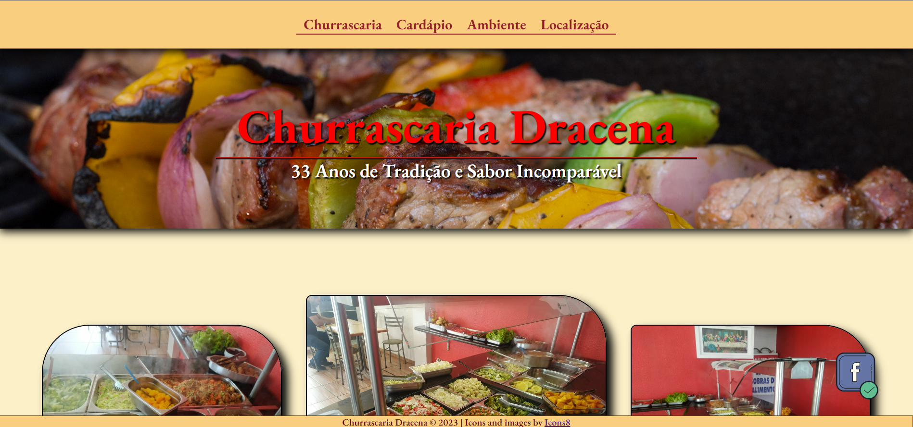
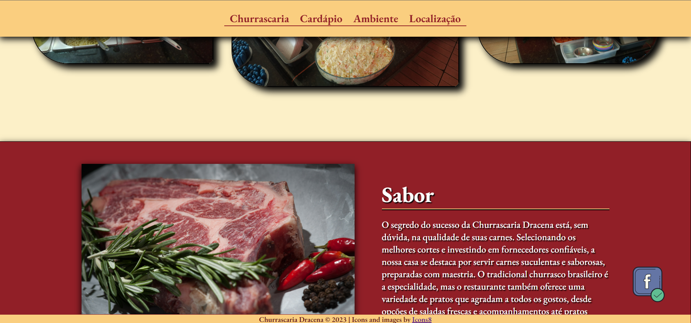
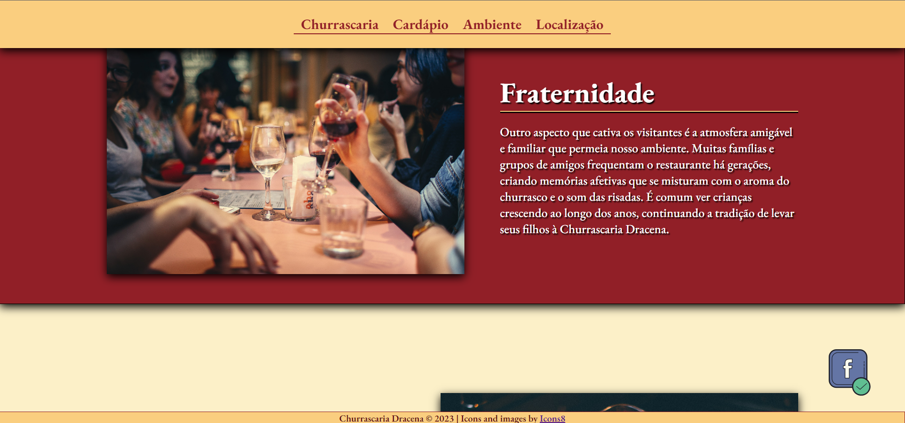

# Acesse agora o projeto online!
- Acesse <a href="#">Ainda não está no ar. Projeto em construção</a> para ver o projeto online!

## Churrascaria Dracena
_Essa aplicação se deu início como um trabalho freelancer que fiz para a Churrascaria Dracena, onde me permitiram manter o código público. 
O Sistema Web criado é original e possui [MIT License](https://github.com/EduardoKayke/Churrascaria_Dracena/blob/main/LICENSE).


### O que a aplicação faz?
É um sistema web de apresentação da Churrascaria Dracena. Temos a página Churrascaria, com informações sobre a mesma, temos também a página do Cardápio do Ambiente e a Localização. 
    
### Ferramentas utilizadas.
- __HTML__
- __CSS__
- __SASS__
- __PHP__

### Como rodar a aplicação?
- Primeiro você deve fazer o download do [xampp.](https://www.apachefriends.org/index.html)
- Depois de baixar, você deve ir até a pasta __htdocs__, dependendo do sistema operacional pode mudar, mas geralmente é no caminho a seguir:
    ```code
    C:\xampp\htdocs
    ```
- Clone esse repositório usando o comando abaixo:
    ```code
    https://github.com/EduardoKayke/Churrascaria_Dracena.git
    ```
- Ou realize o download do repositório clicando [aqui](https://github.com/EduardoKayke/Churrascaria_Dracena/archive/refs/heads/main.zip).
- Jogue dentro da pasta __htdocs__ o repositório que acabou de baixar.
- Inicialize a aplicação do xampp e de start no __Apache__ e __MySQL__
- Abra seu navegador e digite no campo da url:
    ```code
    http://localhost/Churrascaria_Dracena/
    ```
- Pronto, a aplicação está rodando!

__OBS: Talvez você tenha que adicionar o caminho do PHP no path do sistema, para que o PHP seja reconhecido pelo sistema operacional.__

## Imagens do Projeto
Página (Churrascaria Dracena)

Página (Churrascaria Dracena)

Página (Churrascaria Dracena)
